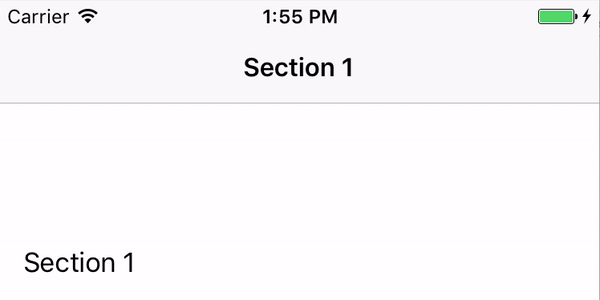

# BMASpinningLabel [](https://travis-ci.org/badoo/BMASpinningLabel)
`BMASpinningLabel` is an UI component which provides easy way for displaying and animating text inside it.
Text changes animated as 'spins' (either downwards or upwards).
Below you can see example how it works.

<div align="center">

</div>

## How to use

To update title

```objectivec
// Creation
BMASpinningLabel *label = [[BMASpinningLabel alloc] init];

// Set initial value
NSAttributedString *initialTitle = [[NSAttributedString alloc] initWithString:@"Initial Title"];
self.label.attributedTitle = initialTitle;

// Update with animation
NSAttributedString *newTitle = [[NSAttributedString alloc] initWithString:@"New Title"];
[self.label setAttributedTitle:newTitle spinDirection:BMASpinDirectionUpward spinSettings:BMASpinSettingsAnimated];
```

## How to install

### Using CocoaPods


1. Include the following line in your `Podfile`:

    ```
    pod 'BMASpinningLabel', '~> 1.0'
    ```

2. Run `pod install`

### Manually

1. Clone, add as a submodule or [download.](https://github.com/badoo/BMASpinningLabel/archive/master.zip)
2. Add the files under `BMASpinningLabel` to your project.
3. Make sure your project is configured to use ARC.

## License

Source code is distributed under MIT license.

##Blog

Read more on our [tech blog](http://techblog.badoo.com/) or explore our other [open source projects](https://github.com/badoo)
